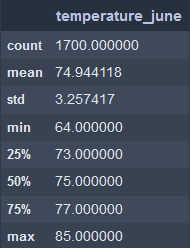
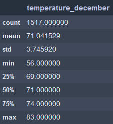

# Surfs Up Analysis

  

## Overview of the Analysis

  

### Purpose
The purpose of this analysis is to find out the temperatures for the months of June and December to determine if the surf and ice cream shop can be sustained year round in Oahu.

  

## Results

Below are the statistics from the temperatures throughout the month of June and December, respectively.
   
 

 - The mean temperature for each month is 71 and 74.9 degrees Fahrenheit meaning only a 3.9 difference.
 - The minimum temperature for December, 56 degrees, is lower than June's, 64 degrees.
 - The maximum temperature for each month only have a difference of 2 degrees. 

## Summary
Based on the Results and the images above, we can see the count, mean, standard deviation, minimum, percentiles, and maximum for June and December. While examining these statistics is helpful, there are a couple more queries that would aid W. Avy in his decision. It'd be helpful to examine the wind speeds during these months to ensure business would stay consistent. Secondly, W. Avy would probably also like to know the tides since with no waves there would be no surfers.
